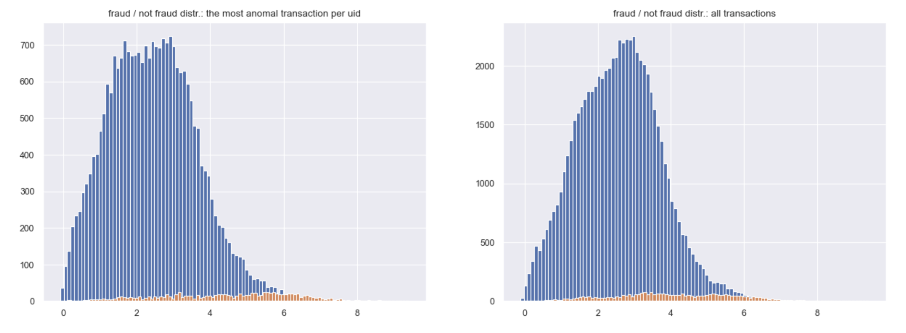

# Application of deep generative models to an anomaly detection problem

[IEEE-CIS Fraud Detection](https://www.kaggle.com/c/ieee-fraud-detection)

### Motivation
This summer I took an advanced course for DGM on computer vision (VAE, (W)GAN, normalizing flows, diffusion models etc.). It was enormously interesting, but since CV is not at the forefront of my professional interests, I decided to spend some time exploring the application of DGM to anomaly detection problems and thereby expand my ML toolkit for more probable tasks.

### Initial plan
For this purpose I took (rather randomly) a data set from IEEE-CIS Fraud Detection Kaggle competition. The initial plan was straightforward:
- Understand and prepare data
- Apply a few of the DGM models I learned in the course:
  - VAE (done)
  - Variational Lossy Autoencoder (in progress)
  - (W)GAN (in progress)

### Data and the task specifics
The dataset consisted of two tables, one of which covered only 1/3 of the total data. For simplicity, I took only the most representative one (~400 features, lots of NaNs). 

Then I ran into a few obstacles:
##### Categorical features
Categorical features cannot be used directly in DGMs:
- Splitting data, and using combined loss function (as it would be possible in case of AE, e.g. MAE for num. features and cosine similarity for each cat. feature) would be incorrect,
- Including embedding layers for cat. features in the (*)VAE model is also impossible (in the limit embeddings will converge to zeros).
  
What can be done in this case:
- take only num. features (in this particular case it was enough, see below)
- separately trane embedding layers (e.g. by applying NCE or InfoNCE approaches) and then use them in (*)VAE with frozen weights 

##### Fraud labeling
This was not specified in the project description, but the dataset was not built properly for fraud detection. The guys from one of the competition teams noticed that a certain combination of attributes could be considered as user identifier. Further, it turned out that the vast majority of users had either only fraudulent or only non-fraudulent transactions associated with them. 

So, the train / val splitting of the training dataset by transactions led to awful over-fitting, on the other hand splitting by user id gave correct results on test dateset, with ROC-AUC score (competition metric) about 0.87 by straightforward CB classification on the all features.

### Solution
The authors of the best solution suggested to reduce the initial problem of fraudulent transaction detection to the fraudulent user detection. For that reason they aggregated all of the data per user id and then worked farther with this modified data set. 

Having in my toolkit a VAE (or similar models), I decided to go a different way.

Models like VAE provide a possibility to measure the degree of normality (reconstruction or ELBO loss). At best, they even can be used to separate the distributions of normal and abnormal objects (transactions). As discussed above, in the case of the problem all transactions associated with the fraudulent user were labeled as fraudulent, but in fact it is highly likely that not all of them were fraudulent.

 In order to overcome this incorrect labeling problem, I decided to reduce the train data set by taking only one the most abnormal (max of reconstruction loss) per user id.

The chart below shows how VAE distinguishes between fraudulent and non-fraudulent transactions in cases of one most anomalous transaction per user / all transactions. ROC-AUC scores (pure VAE) on the validation set were 0.81 and 0.76 respectively.

 Then a simple CB classifier was trained on this reduced dataset. The approach gave a considerable increase in quality - I got about 0.93 ROC-AUC score on validation set (benchmark: 1st place on kaggle 0.944). For my purpose the quality was ok, so I didn't try to improve it, adding the second table or applying any feature selection techniques.

### VAE
I would like to make just one note about VAE training. Scaling is extremely important. In my case, after a couple of experiments I took a pipeline of [log1p, minmax scaler, standard scaler].

